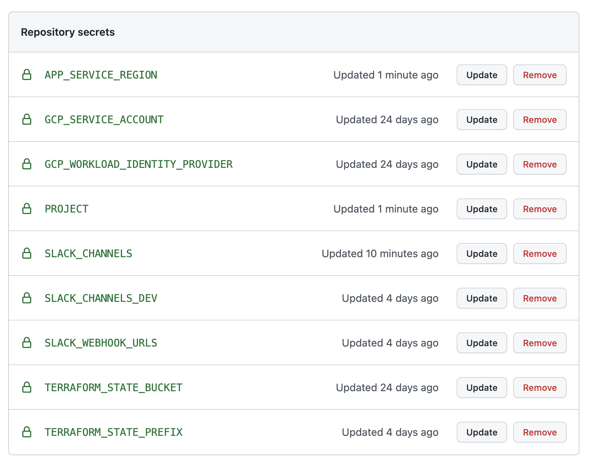

## Create repo in your own GitHub Organisation
* create an empty private or internal repository `domain-protect-gcp-deploy` in your organisation
```
git clone git@github.com:domain-protect/domain-protect-gcp-deploy.git
cd domain-protect-gcp-deploy
git remote set-url origin git@github.com:YOUR_ORG_NAME/domain-protect-gcp-deploy.git
git push
```

## Set up GitHub Actions environment
* GitHub Actions environment is needed for manual approval steps
* within GitHub repository web console, select Settings, Code and automation, Environments
* create new environment `dev` with no protection rules
* create new environment `prd`
* configure Environment protection rules for `prd`
* select Required reviewers
* enter an appropriate team


* save protection rules


## Enter secrets
* Settings, Security, Secrets, Actions, enter Repository secrets:

| REPOSITORY SECRETS             | EXAMPLE VALUE / COMMENT                                                                        |
|--------------------------------|------------------------------------------------------------------------------------------------|
| GCP_WORKLOAD_IDENTITY_PROVIDER | projects/123456789/locations/global/workloadIdentityPools/github-actions/providers/domain-protect-gcp-github |
| GCP_SERVICE_ACCOUNT            | my-service-account@my-project.iam.gserviceaccount.com                                          |
| TERRAFORM_STATE_BUCKET         | tfstate48903                                                                                   |
| TERRAFORM_STATE_PREFIX         | terraform/state/domain-protect-gcp                                                                             |                                                               |                                  |
| SLACK_CHANNELS                 | ["security-alerts"]                                                                            |
| SLACK_CHANNELS_DEV             | ["security-alerts-dev"]                                                                        |
| SLACK_WEBHOOK_URLS             | ["https://hooks.slack.com/services/XXX/XXX/XXX"]                                               | 



Environment variables should be created as secrets where:
* the information is sensitive, e.g. an API key
* the variable would otherwise require double quotes, e.g. a list with string elements

## Update deploy.yml
* enter additional environment variables to turn on other optional features
* enter additional environment variables to customise settings
* ensure each secret has a corresponding definition in the `env` block at the start of [workflow](../.github/workflows/deploy.yml)
```
git commit -am "environment variable update"
git push
```