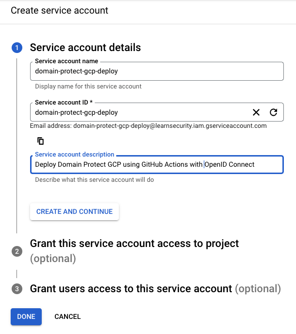
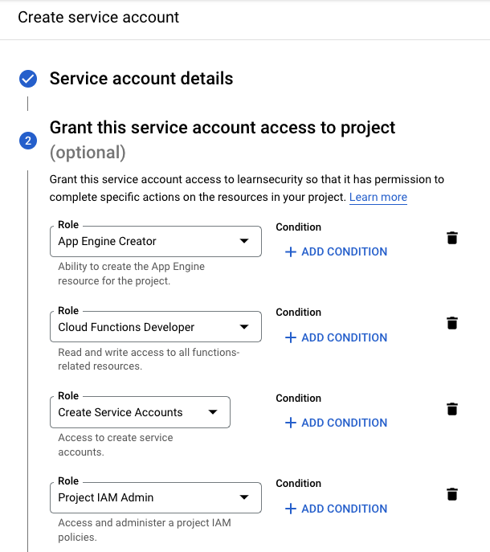
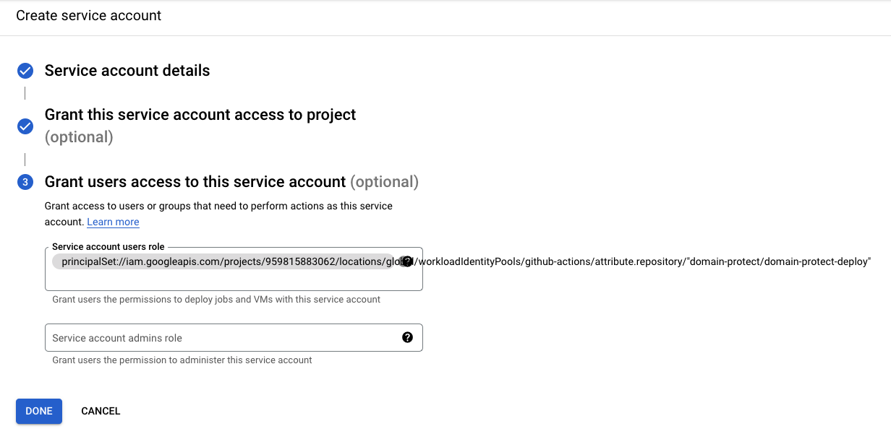

## GCP service account configuration for OIDC
* log in to security tooling GCP project 
* select IAM & Admin, Service Accounts
* press Create service account
* enter a name, ID, and description for the service account



* press Create and continue
* add the roles listed in [Domain Protect GCP](https://github.com/ovotech/domain-protect-gcp#deployment-permissions)



* press Continue
* at service account users role, enter:

```
principalSet://iam.googleapis.com/projects/PROJECT_NUMBER/locations/
global/workloadIdentityPools/POOL_ID/attribute.ATTRIBUTE_NAME/ATTRIBUTE_VALUE
```
* example below
* use the project number of your security project
* use the workload identity pool ID, e.g. `github-actions`
* change the attribute value to include the cloned repository in your GitHub Organization
```
principalSet://iam.googleapis.com/projects/959815883062/locations/global/workloadIdentityPools/github-actions/attribute.repository/"domain-protect/domain-protect-gcp-deploy"
```



* after creation, the permission can be viewed in the console at IAM & Admin, Service Accounts, domain-protect-gcp-deploy, Permissions