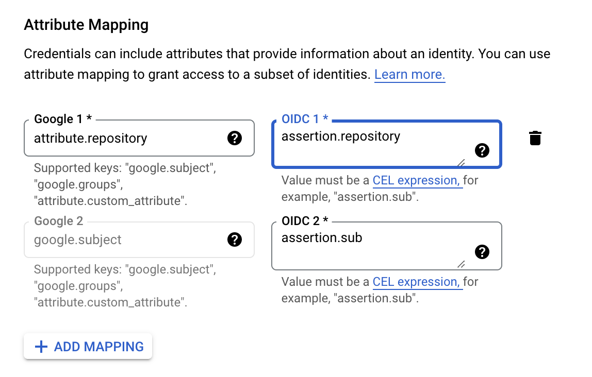

## GCP Workload Identity Federation configuration 
* log in to security tooling GCP project 
* select IAM & Admin, Workload Identity Federation
* if this is the first time in this project, select Get Started
* this will enable required APIs
* create an identity pool
* name the pool `github-actions`, and press Continue

* at Select a provider, choose OpenID Connect
* at Provider name, enter e.g. `GitHub Actions`
* at Provider ID, enter e.g. `domain-protect-gcp-github`
* at Issuer URL, enter `https://token.actions.githubusercontent.com`
* leave Audiences set at Default audience
* press Continue

* Configure provider attributes
* for `google.subject` add `assertion.sub`
* add mapping `attribute.repository` to `assertion.repository`
* do not add any attribute conditions

* press Save
